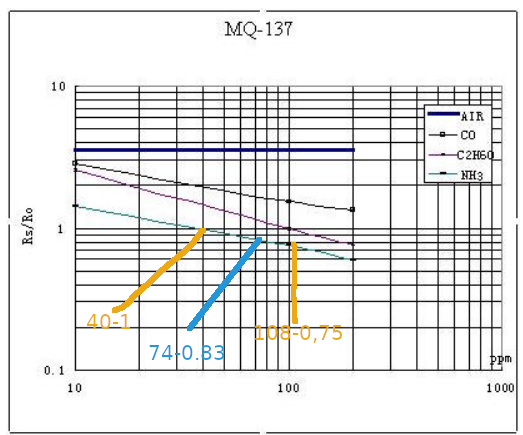

## Manejo de sensor MQ137 

### Datos Utiles
- Constante de aire limpio `3.6`

### Obtencion de Rs para medir aire limpio
- Formula de obtencion de la resistencia de del sensor `Rs= (Vc / VRL -1) * RL`
- Siendo:
  - `Vc` el valor de voltaje de alimentacion de la placa.
  - `VRL` el valor de la muestra convertido en voltaje
  - `RL` el valor de resistencia recomendada por el datasheet

### Obtencion de R0 a partir de Rs y la constante de aire limpio
- Sabiendo que la constante del aire limpio es 3.6
- Podemos despejar R0 a partir de la formula `RS / R0 = CONSTANTE`
- Quedando `RS / CONSTANTE = R0`
- Acomodando `R0 = RS / CONSTANTE`

### Relacionando RS/R0 ratio con PPM
- Usando como ejemplo un valor de Rs de 30, R0= 30/3.6= 108
- 
- Para calcular la pendiente (m) usamos la formula 
- `m = [log(y2) - log(y1)] / [log(x2) - log(x1)]`
- `m = [log(0.75) - log(1)] / [log(108) - log(40)]`
- `m = log(0.75/1) / log(108/40)`
- `m = 0.866 / 1.643`
- `m = 0.527`

- Para calcular el punto medio de x1,x2 (azul)
- `mp = 108-40 = 68`
- `mp = 108 - (68/2) = 74`
- Calcular la intercepcion (b)
- `b = log(y) - m * log(x)`
- `b = log(0.83) - 0.527 * log(74)`
- `b = -1.066`

## Uso

## Bibliografia

- https://circuitdigest.com/microcontroller-projects/arduino-mq137-ammonia-sensor

